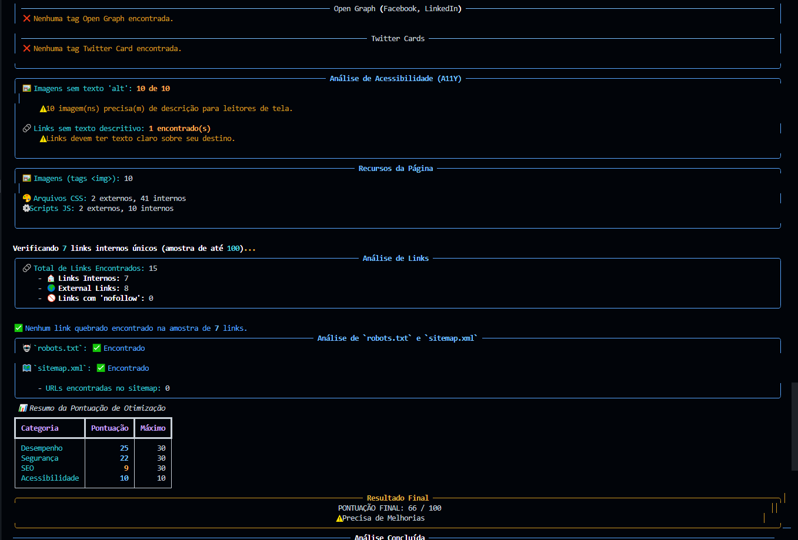

<div align="center">

# 🚀 Website Tester

[](https://www.python.org/)
[](https://github.com/vitinnsz/Website-Tester/main/LICENSE)
[](https://github.com/vitinnsz/Website-Tester/issues)
[](https://github.com/vitinnsz/Website-Tester/stargazers)
[](https://github.com/vitinnsz/Website-Tester/commits/main)

**A powerful CLI tool to analyze SEO, Security, and Performance of any website, with reports directly in your terminal.**

</div>

---

**Website Tester** is a command-line interface (CLI) tool developed in Python that performs a complete analysis of websites. It presents detailed and colorful reports in the terminal, using BeautifulSoap, Requests, WHOIS & `rich`.

---

<div align="center">



*Example of a report generated by the tool.*

</div>

---

## 📋 Table of Contents

- [✨ Features](#-features)
- [🚀 How to Use](#-how-to-use)
- [🔧 Configuration](#-configuration)
- [🗺️ Roadmap](#-roadmap)
- [🤝 How to Contribute](#-how-to-contribute)
- [📧 Contact](#-contact)
- [📜 License](#-license)

---

## ✨ Features

Get a 360º analysis of your site, divided into clear sections:

- 🌐 **General Information**: IP, latency, TTFB, page size, server, and compression.
- 🛠️ **Technologies**: Detection of frameworks (React, WordPress), servers, CDNs, and more.
- 🔐 **Security**: Analysis of HTTPS, essential headers, and SSL certificate validity.
- 📈 **Basic SEO**: Title, meta-description, header structure (H1-H6), and language.
- 🚀 **Advanced SEO**: Verification of `canonical` tags, Open Graph, and Twitter Cards.
- ♿ **Accessibility (A11y)**: Identification of images without `alt` and links without descriptive text.
- 📦 **Resources**: Count of CSS, JS, and image files.
- 🔗 **Links**: Analysis of internal, external, `nofollow` links, and broken link checking.
- 📁 **Standard Files**: Check for the existence of `robots.txt` and `sitemap.xml`.
- 📊 **Final Score**: Scores from 0 to 100 for Performance, Security, SEO, and Accessibility.

---

## 🚀 How to Use

First, clone the repository to your local machine:

```bash
git clone https://github.com/vitinnsz/Website-Tester.git
cd Website-Tester
```

The project uses a `requirements.txt` file to list all necessary Python dependencies. You can install them in two ways: using Docker or in a local virtual environment.

### 🐳 Option 1: Docker (Recommended)

The simplest way to run, without worrying about dependencies. Docker uses the `requirements.txt` file to build an isolated environment with everything the tool needs.

```bash
docker-compose run --rm website-tester
```
> **Note**: The `docker-compose run` command allows for interactive data input, such as the website URL.

### 🐍 Option 2: Local Environment (Python 3.8+)

To run locally, it is recommended to create a virtual environment to isolate the project's dependencies.

#### Using `uv` (Fast and Modern)
`uv` is an extremely fast package installer and virtual environment manager. If you are looking for maximum performance during installation, this is the best option.

```bash
# Install uv if you don't have it: pip install uv
uv venv
source .venv/bin/activate # On Windows: .venv\Scripts\activate
uv pip install -r requirements.txt
python main.py
```

#### Using `venv` + `pip` (Standard)
If you don't have `uv` or prefer the traditional Python approach, use `venv` to create the environment and `pip` to install the packages listed in `requirements.txt`.

```bash
python -m venv .venv
# On Windows: .venv\Scripts\activate
source .venv/bin/activate
pip install -r requirements.txt
python main.py
```

---

## 🔧 Configuration

You can customize the tool's behavior by editing the `config.py` file:

```python
# config.py
LANGUAGE = "en-us"        # Report language
FIXED_URL = True          # Use a fixed URL or ask on each run
URL = "https://example.com" # URL to use if FIXED_URL is True
BROKEN_LINKS = True       # Enable broken link checking
CHECK_DOMAIN_INFO = True  # Enable domain information query
LINK_SAMPLE_SIZE = 50     # Number of links to sample for checking
```

---

## 🗺️ Roadmap

Features planned for the future:

- [ ] **Report Export**: Save analyses in JSON, CSV, TXT, and Markdown.
- [ ] **REST API**: Make the tool available as a service for external consumption.
- [ ] **CI/CD Integration**: Facilitate use in automation pipelines (e.g., GitHub Actions).
- [ ] **Advanced Performance Analysis**: Include metrics like Core Web Vitals.
- [ ] **Cookie Verification**: Analyze compliance with LGPD and GDPR.

---

## 🤝 How to Contribute

Your contribution is very welcome! Follow the steps below:

1.  **Fork** the project.
2.  Create a new branch: `git checkout -b feature/your-amazing-feature`
3.  Commit your changes: `git commit -m 'feat: Add an amazing feature'`
4.  Push to your branch: `git push origin feature/your-amazing-feature`
5.  Open a **Pull Request**.

For bugs or suggestions, please [open an issue](https://github.com/vitinnsz/Website-Tester/issues).

---

## 📧 Contact

Developed by **Victor**

[](https://victordeveloper.com)
[](https://www.linkedin.com/in/victorsdev/)

---

## 📜 License

Distributed under the MIT License. See the [`LICENSE`](LICENSE) file for more details.